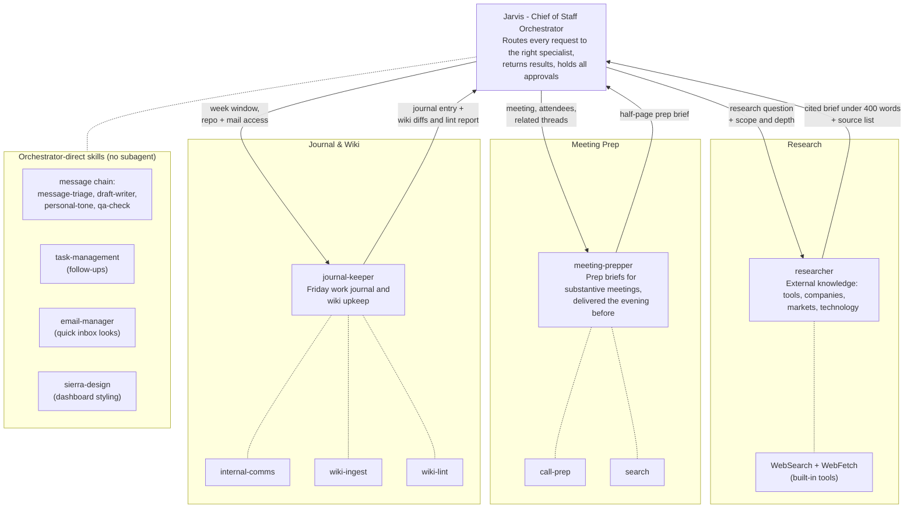

# Jarvis Agent System

Orchestrator and subagent architecture. Rendered live by GitHub.

```mermaid
flowchart TD
    J["Jarvis - Chief of Staff Orchestrator
    Routes every request to the right specialist,
    returns results, holds all approvals"]

    subgraph RG["Research"]
        R["researcher
        External knowledge: tools, companies,
        markets, technology"]
        RT["WebSearch + WebFetch
        (built-in tools)"]
        R -.- RT
    end

    subgraph MG["Meeting Prep"]
        M["meeting-prepper
        Prep briefs for substantive meetings,
        delivered the evening before"]
        MS1["call-prep"]
        MS2["search"]
        M -.- MS1
        M -.- MS2
    end

    subgraph KG["Journal & Wiki"]
        K["journal-keeper
        Friday work journal and
        wiki upkeep"]
        KS1["internal-comms"]
        KS2["wiki-ingest"]
        KS3["wiki-lint"]
        K -.- KS1
        K -.- KS2
        K -.- KS3
    end

    subgraph DG["Orchestrator-direct skills (no subagent)"]
        DS1["message chain:
        message-triage, draft-writer,
        personal-tone, qa-check"]
        DS2["task-management
        (follow-ups)"]
        DS3["email-manager
        (quick inbox looks)"]
        DS4["sierra-design
        (dashboard styling)"]
    end

    J -->|"research question
    + scope and depth"| R
    R -->|"cited brief under 400 words
    + source list"| J

    J -->|"meeting, attendees,
    related threads"| M
    M -->|"half-page prep brief"| J

    J -->|"week window,
    repo + mail access"| K
    K -->|"journal entry +
    wiki diffs and lint report"| J

    J -.- DG
```
